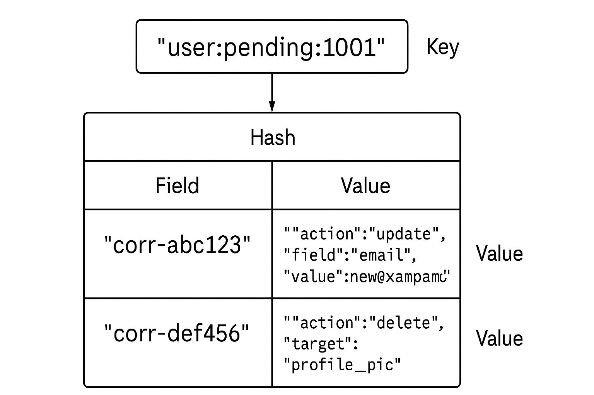

# Redis-Based User Payload Queue

This project is a Spring Boot application that manages **pending payloads per User** using **Redis Hashes**. It ensures:
- Unique Correlation IDs per User.
- Direct storage of JSON payloads in Redis.
- Atomic read & delete (consume) operations.

---

## Features
- Store multiple payloads per User.
- Guarantee Correlation ID uniqueness.
- Retrieve and delete all payloads for a User atomically.
- REST API for adding and consuming payloads.
- Lightweight Redis setup (Docker-ready).

---

## Redis Data Model
- **Key Pattern**: `user:pending:{userId}`
- **Type**: Redis **Hash**
- **Field**: Correlation ID (unique per user)
- **Value**: JSON Payload (as String)

---
 

## API Endpoints

### 1. Add Payload
- **POST** `/v1/api/redis/addPayload`
- **Body**: JSON Payload
```bash
curl --location 'http://localhost:8080/v1/api/redis/addPayload' \
--header 'Content-Type: application/json' \
--data '{
  "userId": "user_id_2",
  "assignmentId":"ass_id_12",
  "clientId":"cli_id_1",
  "corrId": "ae2826de-e6aa-4911-b0a4-4d4767168217",
  "eventOrigine":"assignment-created",
  "metadata": {
    "source": "gds",
    "timestamp": "2025-08-04T12:34:56Z"
  }
}
```
### 2. Get Payload
- **GET** `/v1/api/redis/getPayload/{userId}`
- **PathVariable**: userId
```bash
curl --location 'http://localhost:8080/v1/api/redis/getPayload/user_id_2'
```

### 3. Test Concurrent Read
- **GET** `/v1/api/redis/test-concurrent-read/{userId}/{threadCount}`
- **PathVariable**: userId, threadCount

```bash
curl --location 'http://localhost:8080/v1/api/redis/test-concurrent-read/user_id_2/10'
```
## How It Works
### 1. Add Payload:

- Stores payload in a Redis Hash: user:pending:{userId}.

- Field = Correlation ID.

- Value = JSON Payload (stringified).

### 2. Consume & Delete:

- Lua script executes HGETALL and DEL atomically.

- Guarantees no race conditions.

- After reading, payloads are deleted immediately.

## Example
